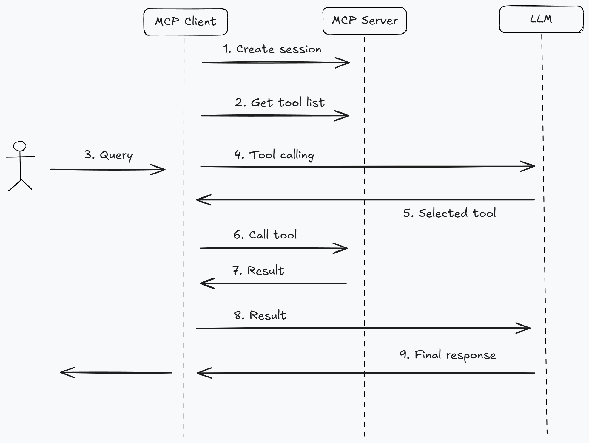

# Kopilot MCP

> A MCP **remake** 🔧 of my [previous](https://github.com/KokoiRuby/k8s-copilot) project.

## Key Features

- Create an AI Kubernetes agent using [MCP](https://github.com/modelcontextprotocol).
- Interact with Kubernetes resources using natural language.
- Customize LLM provider to perform "kubectl-like" commands.
- Learn how to use MCP to standardize tool calling.

## Tech Stack

- [Dynaconf](https://dynaconf.com/)
- [kubernetes](https://github.com/kubernetes-client/python)
- [LangChain](https://www.langchain.com/)
- [Loguru](https://github.com/Delgan/loguru)
- [OpenAI](https://openai.com/)

## Getting Started

### Prerequisites

- [Python](https://www.python.org/downloads/) 3.12+
- [uv](https://docs.astral.sh/uv/)
- A API key from LLM provider (e.g. [OpenRouter](https://openrouter.ai/))
- A Kubernetes cluster. (e.g. [kind](https://kind.sigs.k8s.io/))

### Setup

1. Clone this repository.
2. Configure `config/dev/example.toml` and rename it to `config/dev/config.toml`.
3. Install dependencies.

```bash
uv sync
```

### Run

1. Run the MCP client. It will automatically start the MCP server.

```bash
uv run mcp_client.py
```

2. Then you would see a prompt in the terminal:

```bash
Query (Type `exit`, `quit`, `q` to quit):
```

3. Interact with natural language to operate Kubernetes resources. For example:

```bash
Query (Type `exit`, `quit`, `q` to quit): Get po in kube-system ns
```

4. You would get the response similar like:

```bash
Here are the pods in the `kube-system` namespace:

- coredns-7db6d8ff4d-lz4s8
- coredns-7db6d8ff4d-qbgvc
- etcd-test-control-plane
- kindnet-cnjm6
- kube-apiserver-test-control-plane
- kube-controller-manager-test-control-plane
- kube-proxy-v647r
- kube-scheduler-test-control-plane
- sealed-secrets-controller-67767c668-dz4bj
```

## Project Structure

```bash
kopilot-mcp
├── README.md             # Project documentation
├── config                # Configuration
│   ├── config.py
│   └── dev
│       └── example.toml
├── mcp_client.py         # MCP client
├── mcp_server.py         # MCP server
├── mcp_server_factory.py # MCP server factory
├── pyproject.toml        # Python project meta
├── scheme                # scheme (Kubernetes GVR ➡ GVK)
│   ├── __init__.py
│   └── scheme.py
├── utils                 # Utilities
│   ├── __init__.py
│   ├── clients.py
│   ├── helpers.py
│   └── models.py
└── uv.lock               # uv lock file
```

## Workflow



## Contributing

1. Fork the repository.
2. Create your feature branch.
3. Submit a pull request.

## License

MIT License - See [LICENSE](https://github.com/bitswired/demos/blob/main/projects/introduction-to-mcp-with-sql-agent/LICENSE) file for details.
